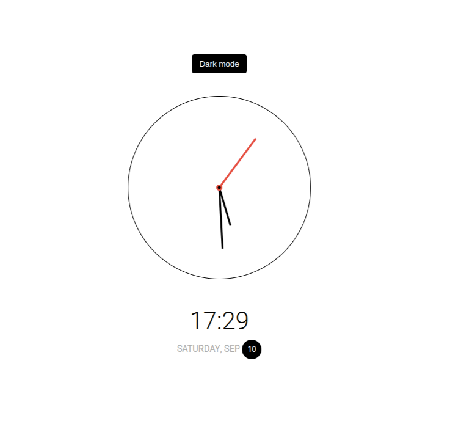
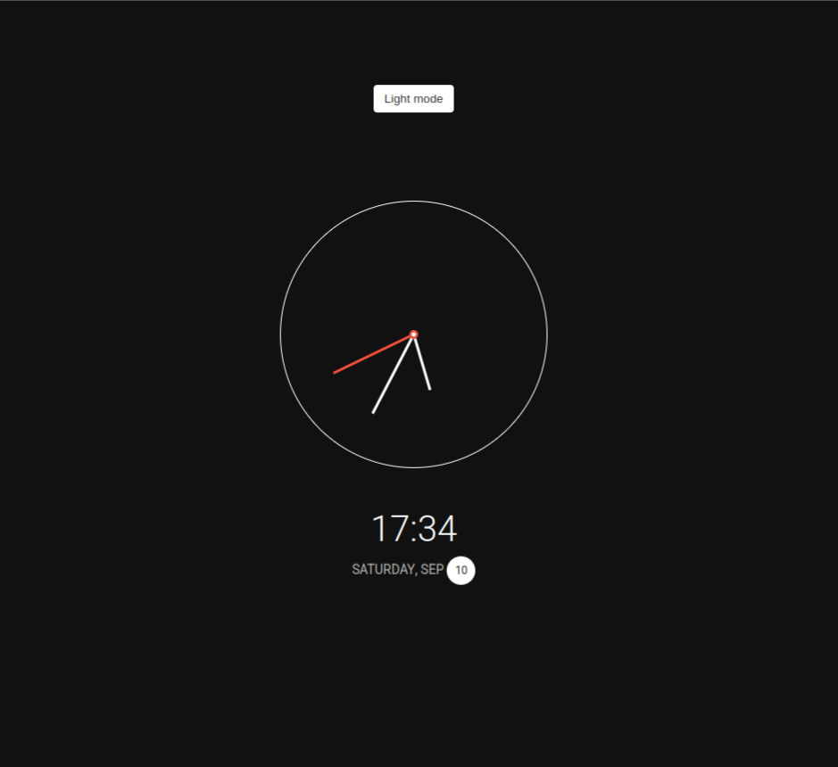

# Minimalistic JavaScript Powered Clock

Another Code along project from the Traversy Media's 50Projects50Days course. Javascipt powered clock that also shows the digital read out like the week day and the date.

## JavaScript:

- Toggle to dark/light mode
- DOM manipulation in real-time
- Using the new Date() constructor to extract hours, minutes and seconds etc..
- Ternary operator
- Scale function (mapping a range of numbers to another range of numbers --> taken from Stack Overflow :))

## Screenshots

